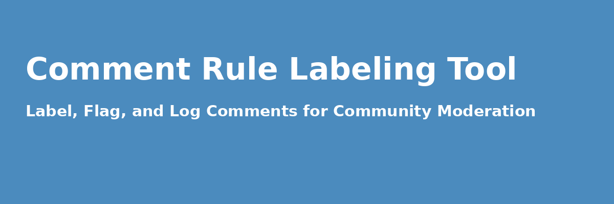

[](https://comment-rule-labeling.streamlit.app/)
[](LICENSE)
[](https://www.python.org/)
[](CONTRIBUTING.md)
[](https://github.com/bfiliks/comment-rule-labeling/issues)

> A collaborative tool for labeling YouTube comments based on YouTube community rules. Built with **Streamlit** and **Google Sheets Sync** to enable multiple annotators to work remotely without duplication.

---

## 🚀 Live App

🌐 [Click here to try the live app](https://comment-rule-labeling.streamlit.app/)

---

## 🖼️ Features

- 🔐 Annotator login with name tracking
- 🗂️ Google Sheets-based collaborative annotation
- 🏷️ Binary labeling (0 = Not violating, 1 = Violates rule)
- 🏁 Flag uncertain examples
- 💬 Leave optional notes per annotation
- 📈 Live progress tracker (overall + per user)
- 🔎 Keyword search to filter comment/rule pairs
- ➕/- Manual navigation controls

---

## 📁 Folder Structure

```bash
.
├── app.py                    # Main Streamlit App
├── requirements.txt          # Python dependencies
├── .streamlit/
│   └── config.toml           # Streamlit config for favicon, theme
└── README.md                 # This file

---
## 🧪 Local Setup

## To deploy on Streamlit Cloud:
1. Push this repo to GitHub
2. Visit https://streamlit.io/cloud
3. Click 'New App' and link your GitHub repo

## 🛠 How to Use This Tool

1. **Launch the App**
   - Visit: `https://https://comment-rule-labeling.streamlit.app/`
   - Enter your **annotator name** to begin

2. **Upload CSV File**
   - Format: `rule_text`, `text`, `input`
   - Make sure your data includes paired rules and comments

3. **Label and Annotate**
   - Choose whether the comment violates the rule (0 = No, 1 = Yes)
   - Optionally add a flag or comment
   - All annotations are automatically tagged with your name and timestamp

4. **Search or Filter**
   - Use the search bar to find keywords
   - Filter by specific rules

5. **Export Labeled Data**
   - Click “Download Labeled Data” to save your results as a CSV
